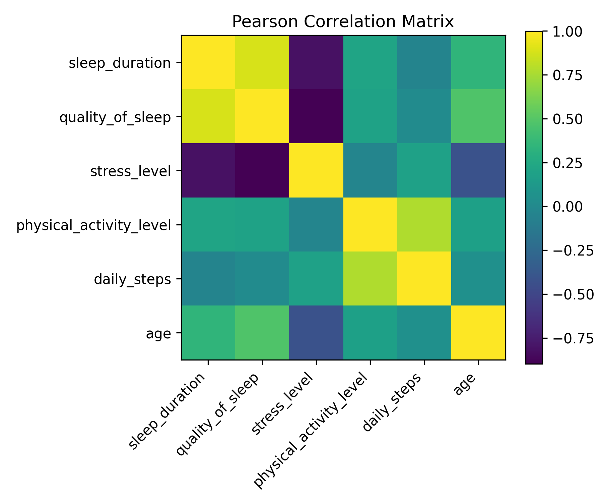
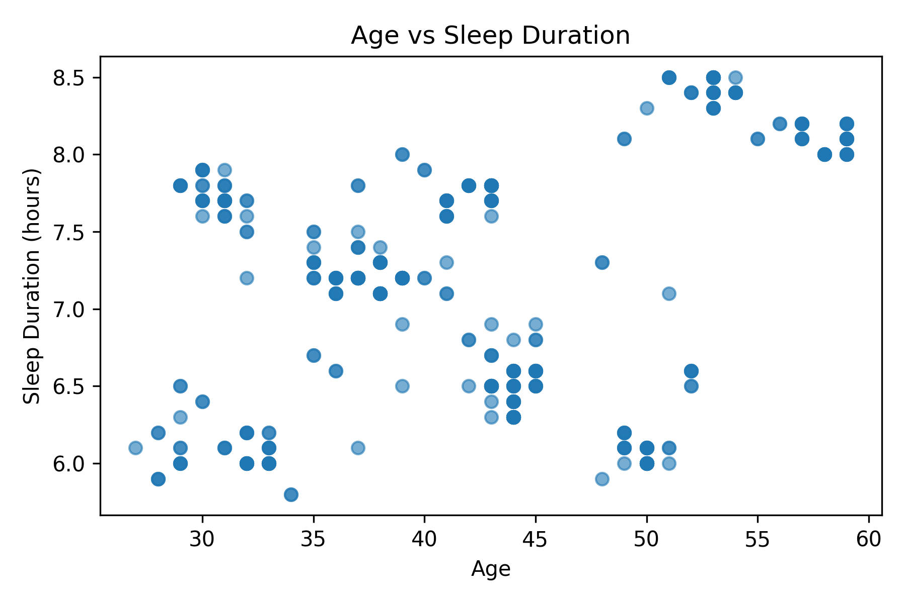
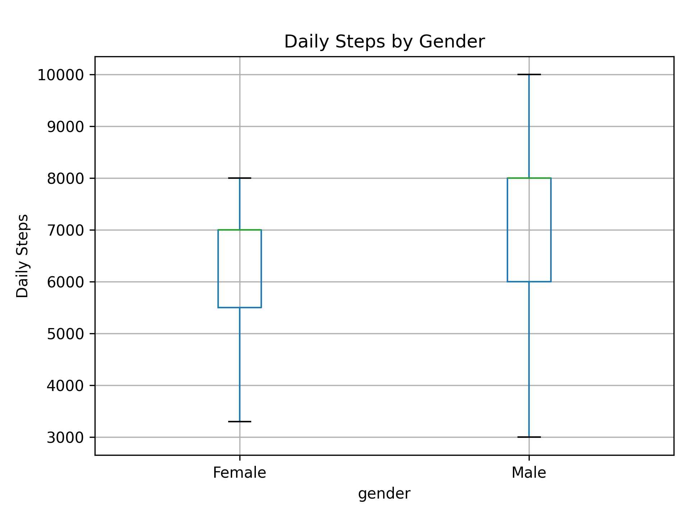
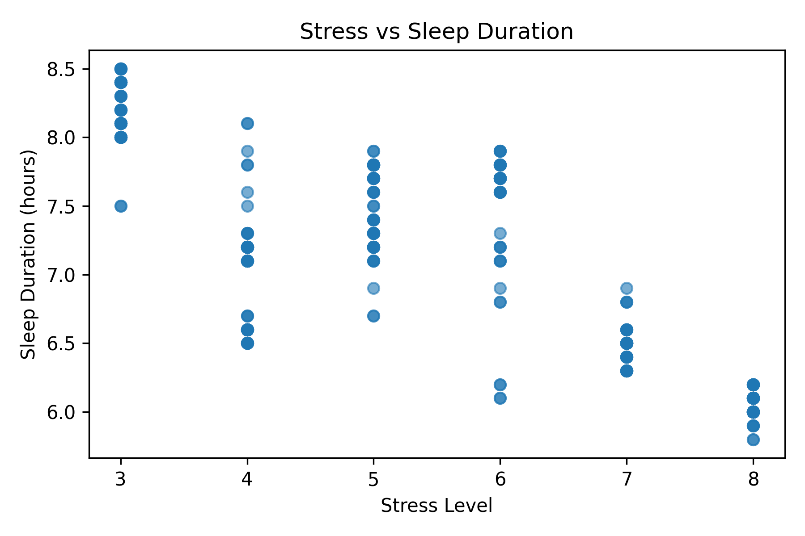

# Lifestyle & Sleep Pattern Analysis  

*A guided exploration of how lifestyle, physiology, and sleep weave into a system.*  

  
  
  
  

  

---

## Context  

The analysis builds on the [Lifestyle and Sleep Patterns dataset](https://www.kaggle.com/datasets/minahilfatima12328/lifestyle-and-sleep-patterns). At the surface, it is a spreadsheet of ages, occupations, stress ratings, blood pressure values, and hours of sleep. But viewed correctly, it becomes something more: a system of interacting variables that either support or erode rest, recovery, and long-term health.  

This notebook approaches the dataset the way a neuroscientist would approach a physiology experiment: begin with baselines, establish reliable measures, then anchor on single variables - sleep duration, sleep quality, stress, activity, BMI, blood pressure, heart rate, daily steps, or disorder status - and map how the rest of the system shifts around them.  

---

## The Journey Through the Notebook  

1. **Baselines**: Like checking vital signs before an intervention, we first establish means, medians, distributions.  
2. **Correlations**: Subtle patterns are quantified - not yet explanations, but signals of possible relationships.  
3. **Anchored visualisations**: Each variable, in turn, is placed at the centre. Around it radiate boxplots, scatter plots, and bar charts. This creates a kind of *atlas* - stress seen through sleep, activity seen through BMI, heart rate seen through age.  
4. **Closing synthesis**: Themes emerge only once you step back: sleep at the hub, activity as leverage, stress as a multiplier, physiology as a mirror.  

---

## Selected Visuals  

  
  

  

  
  

  

---

## What Emerges  

Across anchors, certain patterns are steady:  

- **Sleep sits at the centre.** Both duration and quality ripple outward into stress, cardiovascular load, and daily behaviour.  
- **Movement is leverage.** Activity and steps consistently align with more favourable profiles.  
- **Stress is a multiplier.** It appears wherever strain shows up, amplifying deficits in sleep and physiology.  
- **Disorders reset the baseline.** Clinical conditions shift the entire system, not just the night’s rest.  

And always, the important boundary: correlation is not causation. These are hypotheses - invitations to design further tests, not proofs of mechanism.  

---

## Why This Matters  

Science advances by frameworks as much as by facts. This notebook is not a finished report, but a **scaffold for exploration**. With it, you can:  

- Re-run the analysis on new data cohorts.  
- Extend the model with richer signals (heart rate variability, caffeine intake, time-of-day effects).  
- Treat it as a generative engine for hypotheses in sleep and lifestyle science.  

The file structure (`data/`, `outputs/`, `outputs/plots/`) ensures reproducibility. Every chart and table is traceable back to the data.  

---

## License  

This repository is licensed under the [MIT License](LICENSE).  